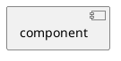
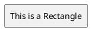
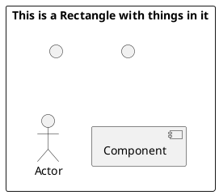
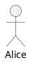
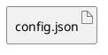

# Objects

[<-Home](../../README.md)

## Contents
[Component](#component) 
[Interface](#interface) 
[Rectangle](#rectangle) 
[Actor](#actor) 
[Artifact](#artifact) 

<a name="component"/>

## Component

<a name="interface"/>

## Interface

```plantuml
@startuml
() "This is an interface" as myInterface
@enduml
```

<a name="rectangle"/>

## Rectangle

Rectangles can group other objects:

<a name="actor"/>

## Actor

Note that if you use keyword 'actor', it will assume format of a sequence diagram. Use colons around actor name instead.

Can change colour etc with skinparams:

```plantuml
@startuml
skinparam ActorBorderColor black
skinparam ActorBackgroundColor white
:"Alice":
actor "Bob"
@enduml
```

<a name="artifact"/>

## Artifact

An artifact in UML is generally a file

